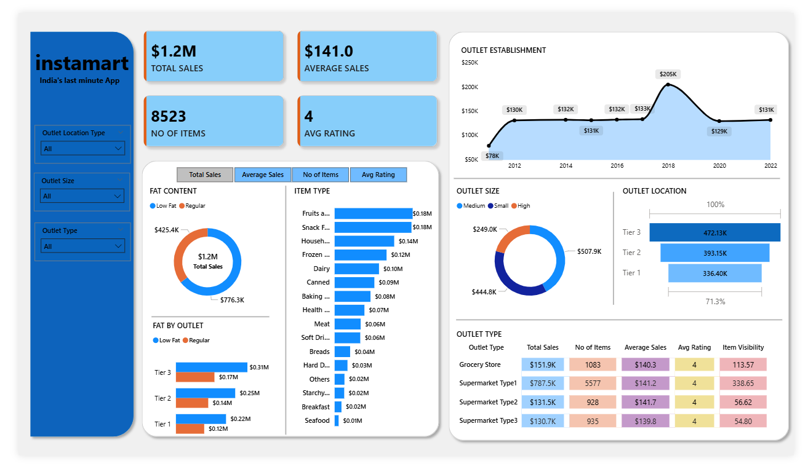

# 🛒 Instamart Data Analysis Dashboard

## 📌 Project Overview

This project presents a comprehensive **Power BI dashboard** built to analyze **Instamart’s sales performance, customer behavior, product trends, and operational metrics**.

The analysis was performed using:

- **MySQL** for data extraction, SQL querying, and aggregations  
- **Python** for data cleaning, preprocessing, and EDA  
- **Power BI** for dashboard creation and visual analytics  

The dashboard provides meaningful insights using KPIs, charts, and interactive filters to understand business performance and identify optimization opportunities.

---

## 🛠 Tech Used

### 🗃️ MySQL Workbench  
- Data storage  
- SQL joins, aggregations, filtering  
- Data extraction for analysis  

### 🐍 Python (Pandas, NumPy, Matplotlib)  
- Data cleaning & transformation  
- Missing value handling  
- Exploratory Data Analysis (EDA)  
- Feature creation  
- Exporting processed data for Power BI  

### 📊 Power BI  
- KPI cards  
- Advanced charts & visuals  
- Interactive filters & slicers  
- Data modeling  

### ⚙️ Power Query  
- Data shaping & transformation  
- Schema adjustments  
- Automated refresh steps  

### 🧮 DAX  
- Custom measures such as:  
  - Total Sales  
  - Average Sales
  - No of items 
  - Metrics
  - Average Rating  

---

## 📊 Key Performance Indicators (KPIs)

The dashboard highlights the following essential KPIs:

- **Total Sales**- The overall revenue generated from all items sold. 
- **Average Sales**: The average revenue per sale. 
- **Number of Items**: The total count of different items sold. 
- **Average Rating**: The average customer rating for items sold. 
  
---

## ⭐ Features

### 🔍 Filter Panel
- Filter by outlet location type
- Filter by outlet size  
- Filter by outlet type  

---

## 🐍 + 🗃 Python & SQL Data Processing

### ✔ SQL Tasks
- Data extraction from MySQL tables  
- Joining multiple datasets  
- Aggregations (SUM, COUNT, AVG, etc.)  
- Removing duplicates & inconsistencies  

### ✔ Python Tasks
- Handling missing values  
- Processing timestamps & durations  
- Creating new calculated columns  
- Exporting cleaned CSV files for Power BI  

---

## 📈 Insights and Conclusions

- Strong overall sales performance with upward trends  
- Essential and fast-moving products drive major revenue  
- Returning customers contribute significantly to total revenue  
- Faster deliveries result in better customer ratings  
- Medium and large outlet locations produce higher sales    

---

## Screenshot

### 📊 Dashboard Previews

## 📝 NOTE

This analysis was created as part of a **data analytics project** and is intended for **learning and portfolio purposes only**.

